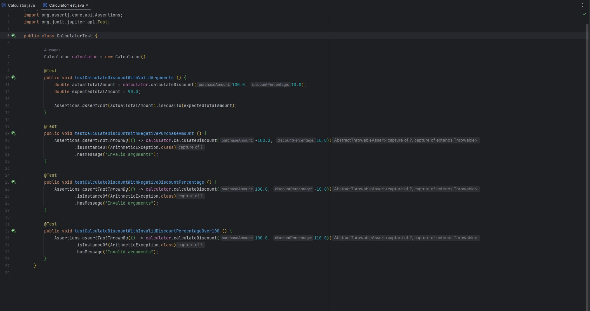
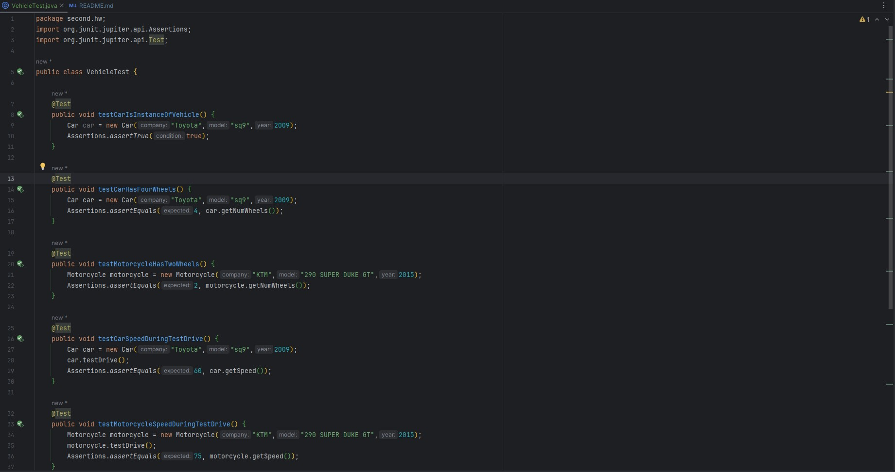
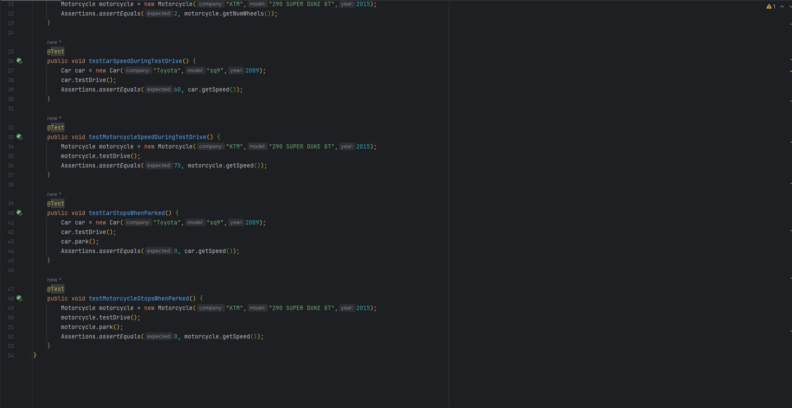
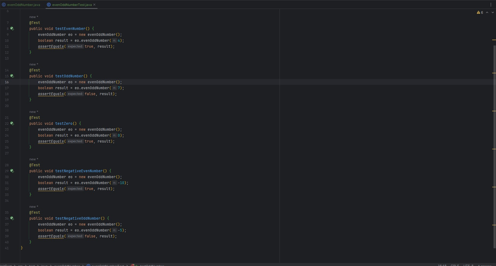
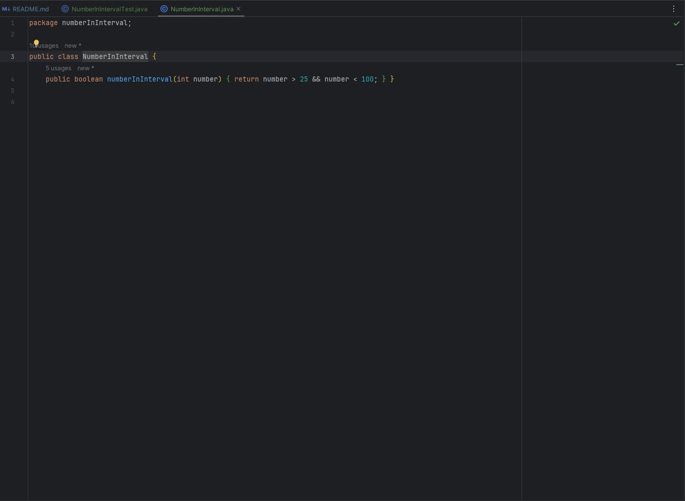
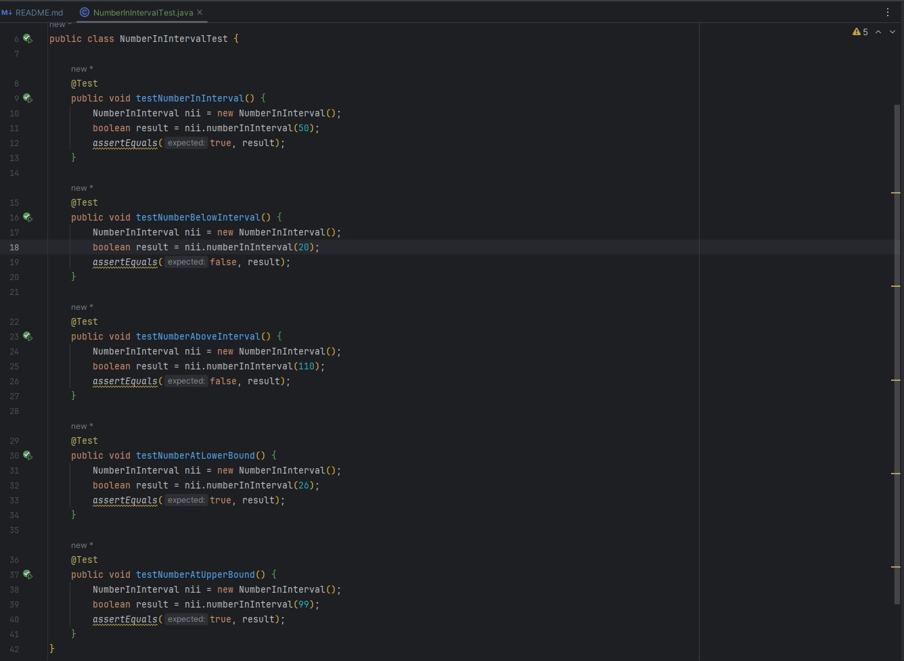
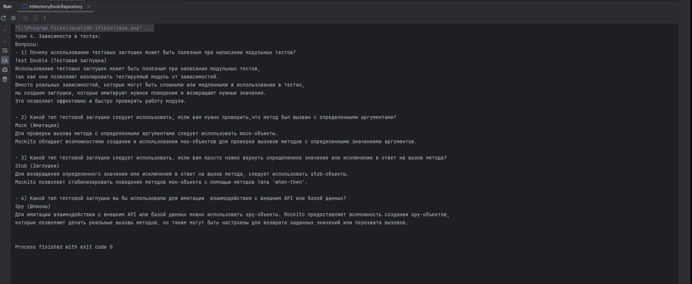
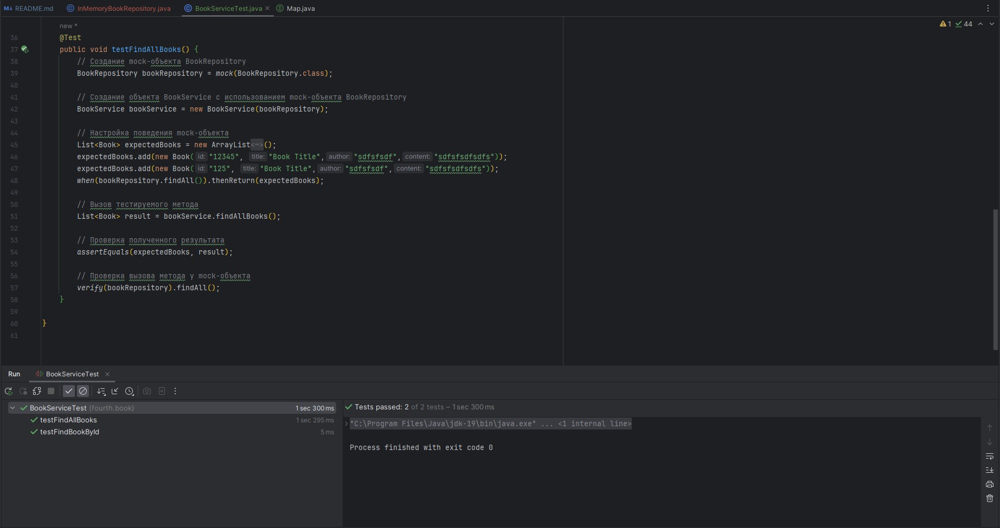

#  Unit-тесты (семинары)

Урок 1. Цели и смысл тестирования

        Задание 1. В классе Calculator создайте метод calculateDiscount, который принимает сумму покупки и процент скидки и возвращает сумму с учетом скидки. 

        Ваша задача - проверить этот метод с использованием библиотеки AssertJ. Если метод calculateDiscount получает недопустимые аргументы, он должен выбрасывать исключение ArithmeticException. 
        Не забудьте написать тесты для проверки этого поведения.

Урок 2. Знакомство с тестовыми фреймворками

        Задание 1. Проект Vehicle. Написать следующие тесты с использованием JUnit5:

        - Проверить, что экземпляр объекта Car также является экземпляром транспортного средства (используя оператор instanceof).
        - Проверить, что объект Car создается с 4-мя колесами.
        - Проверить, что объект Motorcycle создается с 2-мя колесами.
        - Проверить, что объект Car развивает скорость 60 в режиме тестового вождения (используя метод testDrive()).
        - Проверить, что объект Motorcycle развивает скорость 75 в режиме тестового вождения (используя метод testDrive()).
        - Проверить, что в режиме парковки (сначала testDrive, потом park, т.е. эмуляция движения транспорта) машина останавливается (speed = 0).
        - Проверить, что в режиме парковки (сначала testDrive, потом park, т.е. эмуляция движения транспорта) мотоцикл останавливается (speed = 0).
        В этом проекте, вы будете работать с проектом ""Vehicle"", который представляет собой иерархию классов, включающую абстрактный базовый класс ""Vehicle"" и два его подкласса ""Car"" и ""Motorcycle"".
        Базовый класс ""Vehicle"" содержит абстрактные методы ""testDrive()"" и ""park()"", а также поля ""company"", ""model"", ""yearRelease"", ""numWheels"" и ""speed"".
        Класс ""Car"" расширяет ""Vehicle"" и реализует его абстрактные методы. При создании объекта ""Car"", число колес устанавливается в 4, а скорость в 0. В методе ""testDrive()"" скорость устанавливается на 60, а в методе ""park()"" - обратно в 0.
        Класс ""Motorcycle"" также расширяет ""Vehicle"" и реализует его абстрактные методы. При создании объекта ""Motorcycle"", число колес устанавливается в 2, а скорость в 0. В методе ""testDrive()"" скорость устанавливается на 75, а в методе ""park()"" - обратно в 0.

Урок 3. Качество тестов

        Напишите тесты, покрывающие на 100% метод evenOddNumber, который проверяет, является ли переданное число четным или нечетным.

        Разработайте и протестируйте метод numberInInterval, который проверяет, попадает ли переданное число в интервал (25;100).

Урок 4. Зависимости в тестах

        Задание 1. Ответьте письменно на вопросы:
        1)  Почему использование тестовых заглушек может быть полезным при написании модульных тестов?
        2) Какой тип тестовой заглушки следует использовать, если вам нужно проверить, что метод был вызван с определенными аргументами?
        3) Какой тип тестовой заглушки следует использовать, если вам просто нужно вернуть определенное значение или исключение в ответ на вызов метода?
        4) Какой тип тестовой заглушки вы бы использовали для имитации  взаимодействия с внешним API или базой данных?

        Задание 2.
        У вас есть класс BookService, который использует интерфейс BookRepository для получения информации о книгах из базы данных. 
        Ваша задача написать unit-тесты для BookService, используя Mockito для создания мок-объекта BookRepository.

